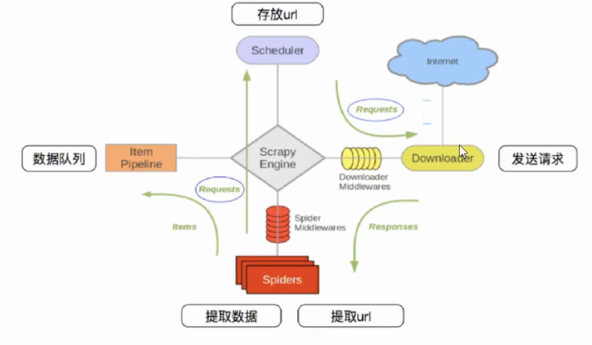
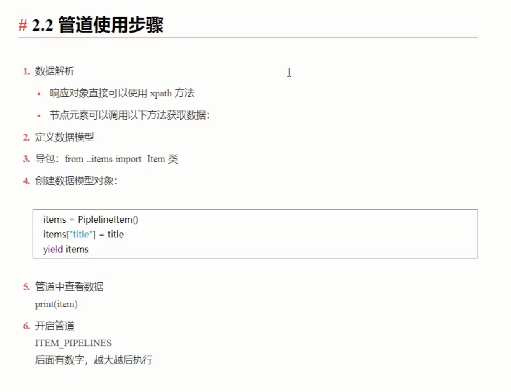

1.创建项目

scrapy startproject baidu

项目框架

1. items.py
2. middlewares.py
3. pipelines.py
4. settings.py

2.创建爬虫

cd to spiders

scrapy genspider NAME www.baidu.com

3.修改配置文件

ROBOTSTXT_OBEY=False //关闭君子协议

LOG_LEVEL="EEORE"  //关闭日志---INFO WARNING

4.运行爬虫

scrapy crawl NAME

# scrapy组成

1. 调度器：管理URL
2. 下载器：发请求
3. 管道：保存数据
4. 中间件：爬虫中间件和下载器中间件
5. 爬虫：写爬虫代码

# scrapy工作流程

1. 启动爬虫生成首批URL转换为请求通过引擎发送给调度器
2. 引擎将这些请求序列发送给下载器进行解析
3. 下载器的响应结果通过引擎发给spider解析响应
4. spider解析完成之后将结果通过引擎交给管道或者生成新的请求
5. 引擎将新的url压入队列

# 管道工作流程

